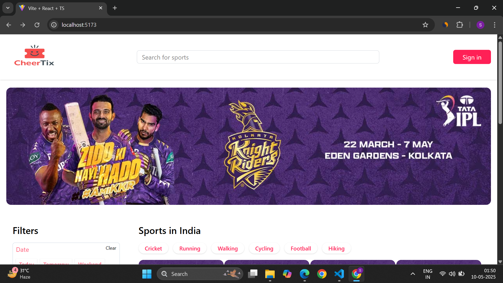
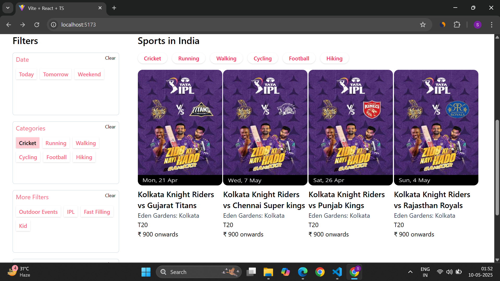
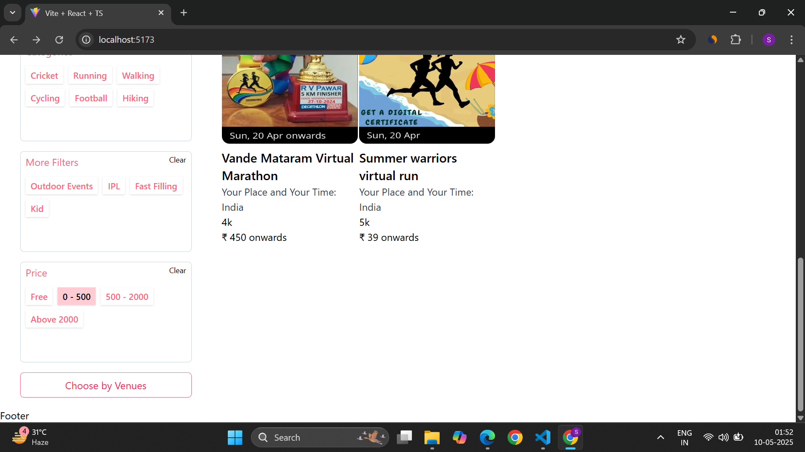
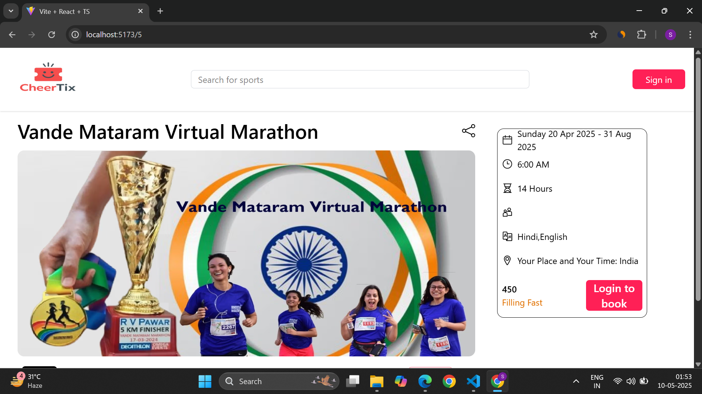

# 🎟️ TickitBooking – Game Ticket Booking Platform (Frontend)


> A sleek and responsive Indian game ticket booking frontend built using **React**, **Tailwind CSS**, and **TypeScript**. This project allows users to browse and book sports/game tickets with intuitive filters, a smart search bar, and a dedicated ticket details page.

---

## ✨ Features

- 🏠 Homepage with:
  - 🎯 Hero section
  - 🔍 Search bar for games
  - 🧰 Filterable ticket listing by type, price, category, and date
- 📄 Ticket Details Page
- 🌐 Fully responsive design for all screen sizes
- ⚡ Fast performance with Vite
- 🛠️ Built with modern frontend stack (React + TypeScript + Tailwind CSS)
- 📦 Routing handled by React Router DOM

---

## 🧱 Tech Stack

| Category       | Tech                           |
|----------------|--------------------------------|
| Framework      | [React](https://reactjs.org)   |
| Language       | [TypeScript](https://typescriptlang.org) |
| Styling        | [Tailwind CSS](https://tailwindcss.com) |
| Routing        | [React Router DOM](https://reactrouter.com) |
| Build Tool     | [Vite](https://vitejs.dev)     |
| Icons          | [React Icons](https://react-icons.github.io/react-icons/) |
| Linting        | [ESLint](https://eslint.org)   |

---

## 🚀 Getting Started

### 1. Clone the Repository

```bash
git clone https://github.com/CODESUJON/Indian-Game-Tickets-Booking-React.git
cd tickitbooking

```bash
npm run dev
```
## 🖼️ Preview

---

### 📄 Sections

#### 🚀 Hero Section


#### 🔍 Filter Section


#### 🧰 Filter Options


#### 🎫 Ticket Details



